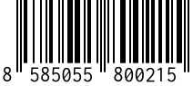

# php-barcode-generator

## Usage in a symfony app

Register following classes in `config/services.yaml`:
```yaml
services:

    # barcode generator
    BeLenka\BarcodeGenerator\TCPDFBarcodeFactory: ~
    BeLenka\BarcodeGenerator\BarcodeGeneratorEAN13:
        arguments:
            - '@BeLenka\BarcodeGenerator\TCPDFBarcodeFactory'

```

Call `getSVGcode()` in your service:
```php
use BeLenka\BarcodeGenerator\BarcodeGeneratorEAN13;
use BeLenka\BarcodeGenerator\BarcodeGeneratorException;

class MyService
{
    public function __construct(
        private BarcodeGeneratorEAN13 $barcodeGeneratorEAN13,
    )
    {
    }

    /**
     * @throws BarcodeGeneratorException
     */
    public function myFunc(string $code): ?string
    {
        try {
            $svg = $this->barcodeGeneratorEAN13->getSVGcode($code);

            return $svg;
        } catch (BarcodeGeneratorException $e) {
            // log exception if needed:
            // $this->logger->warning('Unable to render barcode.', ['exception' => $e]);

            return null;
        }
    }
}
```

Visually, the output should look like this:  

